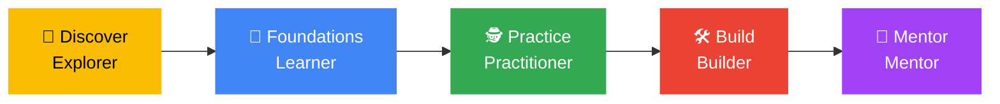

<div align="center">

# 🔐 Cybersecurity Track | GDG on Campus TUM

### From Curious to Capable


[🚀 Getting Started](GETTING-STARTED.md) · [⚖️ Rules](ETHICS-AND-RULES.md) · [🗓️ Roadmap](roadmap/semester-roadmap.md) · [🧭 Learning Path](learning-path/README.md) · [🎓 Sessions](sessions/README.md) · [🧪 Labs](labs/README.md) · [📚 Resources](resources/README.md)

</div>

---

> **Track Lead:** Kimberly and [**my github**](https://github.com/kimmy-sec) · **Sessions:** _[TO CONFIRM] day, time, venue_ · **Channel:** _add group link_

> *"A place where a student can enter with zero experience, discover their interest, build foundational skills, work on a real project, and eventually mentor someone else."*

The Cybersecurity Track makes cybersecurity accessible to **every student at TUM**, from complete beginners with no tech background to students with some technical experience. We follow one clear pathway and learn through labs, challenges and simulations rather than theory alone.

> [!NOTE]
> **Status: draft for discussion.** This plan comes from the Cybersecurity Track proposal. Items marked **[TO CONFIRM]** are waiting for decisions from the Captain and core team. See [OPEN-ITEMS.md](OPEN-ITEMS.md).

> [!IMPORTANT]
> **Read the [rules of engagement](ETHICS-AND-RULES.md) before anything else.** Attack only systems built for the purpose. Never test campus, personal or third-party systems without written permission. Unauthorised access is illegal, including under Kenya's Computer Misuse and Cybercrimes Act.

> [!TIP]
> **Lost in this repo?** Click the **☰ outline button** at the top right of this page for a clickable table of contents. Every other page has a **← Back to Cybersecurity Track home** link at the top.

---

## 🧭 Start here: how to use this repo

### New? Follow these 5 steps

| Step | Do this | Where |
|:-:|---|---|
| **1** | Read the rules of engagement (5 minutes) | [ETHICS-AND-RULES.md](ETHICS-AND-RULES.md) |
| **2** | Complete the setup checklist | [GETTING-STARTED.md](GETTING-STARTED.md) |
| **3** | Start as an **Explorer**: secure your own accounts and phone | [Stage 1: Discover](learning-path/01-discover.md) |
| **4** | Make your first contribution by adding your profile | [members/](members/README.md) |
| **5** | Share your plan with the chapter | [member-roadmaps](https://github.com/GDG-TUM/member-roadmaps) |

### Or jump straight to what you need

| I want to... | Go here |
|--------------|---------|
| **Know what is allowed and what is not** | [Rules of engagement](ETHICS-AND-RULES.md) |
| **Understand the pathway and badges** | [Framework and badges](about/framework-and-badges.md) |
| **See the 13-week calendar** | [Semester roadmap](roadmap/semester-roadmap.md) |
| **See the sessions** | [Session bank](sessions/README.md) |
| **Do the hands-on labs** | [Labs](labs/README.md) |
| **Secure my own accounts and phone** | [Account and phone safety checklist](resources/account-and-phone-safety-checklist.md) |
| **Spot a phishing message** | [Phishing red flags](resources/phishing-red-flags.md) |
| **Join the Cyber × Web project** | [Cyber × Web project](projects/cyber-x-web/README.md) |
| **Get involved beyond sessions** | [Missions, clinics and challenges](engagement/README.md) |
| **Meet the team** | [Team and roles](about/team-and-roles.md) |
| **Look up a security term** | [Glossary](resources/glossary.md) |
| **Prepare for a certification** | [Certifications](resources/certifications.md) |
| **Ask a question** | [Open a question issue](https://github.com/GDG-TUM/cybersecurity-track/issues/new/choose) |
| **Get answers to common questions** | [FAQ](FAQ.md) |

---

<a id="pathway"></a>
## 🛤️ One pathway

Levels are **badges members earn along one pathway**, not separate programmes.



| Stage | Who it serves | Badge / outcome | Semester 1 |
|-------|---------------|-----------------|------------|
| [**Discover**](learning-path/01-discover.md) | Non-tech and curious students | **Explorer:** understands common threats and safe digital habits | Runs in full |
| [**Foundations**](learning-path/02-foundations.md) | Beginners | **Learner:** completes networking, Linux and web fundamentals labs | Runs in full |
| [**Practice**](learning-path/03-practice.md) | Learners ready for hands-on work | **Practitioner:** completes guided investigations and a beginner CTF | One CTF and investigation block |
| [**Build**](learning-path/04-build.md) | Practitioners | **Builder:** contributes to a security-focused project | One Cyber × Web project |
| [**Mentor**](learning-path/05-mentor.md) | Builders | **Mentor:** supports beginners and helps deliver sessions | Pilot: shortlist candidates only |

Advanced specialisations (offensive, defensive/SOC, cloud, AI and mobile pathways), full incident-response simulations and the structured mentor programme are planned for **semester two**.

---

<a id="goals"></a>
## 🎯 Semester objectives

- Make cybersecurity approachable regardless of technical background
- Deliver hands-on labs that turn concepts into skills, **measured by labs completed rather than attendance**
- Complete one meaningful cross-track project with the Web team
- Expose members to cybersecurity careers, entry-level expectations and portfolio building
- Identify and prepare a first group of future peer mentors
- Close the semester with a public showcase and an impact report

---

<a id="calendar"></a>
## 🗓️ 13-week calendar

Click through for details. [Full roadmap →](roadmap/semester-roadmap.md)

| Weeks | Stage | Activities | Evidence |
|-------|-------|-----------|----------|
| 1–2 | Setup | Recruit core team; set up lab environment; publish code of conduct; launch announcement | Team named, lab ready |
| 3–4 | [Discover](learning-path/01-discover.md) | Phishing detective challenge; "Your Phone Is a Crime Scene"; careers session | Mini challenge score |
| 5 | Planning | Kick-off meeting with the Web track lead to scope the joint project | Project brief |
| 5–8 | [Foundations](learning-path/02-foundations.md) | Networking lab; Linux lab; web fundamentals lab; Cyber Clinic | Lab checkpoints |
| 9–10 | [Practice](learning-path/03-practice.md) | Wireshark and log investigation (week 9); beginner CTF (week 10) | CTF score |
| 7–12 | [Build](learning-path/04-build.md) | [Cyber × Web project](projects/cyber-x-web/README.md) in mixed-skill squads, running alongside Foundations and Practice | Repo + documentation |
| 11–12 | Build | Testing, hardening, mentor shortlisting, feedback survey | Test report |
| 13 | Showcase | Public demo; impact report; semester-two planning | Report |

Exam weeks and breaks are **light weeks**: only a [Cyber Clinic](engagement/README.md) or a short take-home mission. **[TO CONFIRM]** exact academic calendar dates.

---

<a id="sessions"></a>
## 🎓 Sessions

Question-driven titles keep sessions memorable. [All sessions →](sessions/README.md)

| Session | Format |
|---------|--------|
| [Would You Survive a Phishing Attack?](sessions/would-you-survive-a-phishing-attack.md) | Interactive phishing detective challenge |
| [Your Phone Is a Crime Scene](sessions/your-phone-is-a-crime-scene.md) | Mobile privacy, permissions and what a device reveals |
| [The Password You Think Is Strong… Isn't](sessions/the-password-you-think-is-strong-isnt.md) | Password attacks, MFA and account takeover, demonstrated safely |
| [Behind the Wi-Fi](sessions/behind-the-wi-fi.md) | Packets, DNS and IPs after you connect |
| [CSI: Cyber — Investigate the Incident](sessions/csi-cyber-investigate-the-incident.md) | Teams reconstruct a fictional breach from logs and clues |
| [Cybersecurity on Your CV](sessions/cybersecurity-on-your-cv.md) | Careers, portfolios, GitHub, certifications, internships |
| [Build It. Break It. Secure It.](sessions/build-it-break-it-secure-it.md) | Build a simple app, test it, then harden it |
| [Cyber Escape Room](sessions/cyber-escape-room.md) | Security-themed puzzles for showcase week |

---

<a id="involved"></a>
## ✅ How to get involved

1. Join the [**GDG-TUM** GitHub organization](https://github.com/GDG-TUM) and turn on two-factor authentication
2. Add your plan in [**member-roadmaps**](https://github.com/GDG-TUM/member-roadmaps) (open a *Member Roadmap* issue)
3. Make your first contribution by [adding your profile](members/README.md)
4. Come to the next session and try a [Cyber Mission](engagement/README.md)
5. Want to help run the track? See [team and roles](about/team-and-roles.md). Open call for the core team in weeks 1–2.
6. Read the [CONTRIBUTING guide](https://github.com/GDG-TUM/.github/blob/main/CONTRIBUTING.md) before your first pull request

---

<a id="good-to-know"></a>
## ⚠️ Good to know

> [!WARNING]
> **Never test anything you do not own or have written permission to test**, including campus, employer and friends' systems, "just to see". Use local VMs, CTF platforms and club-owned labs.

- **Never commit secrets.** No passwords, API keys, tokens or `.env` files in any repo. If it happens, tell a maintainer immediately. See the [security policy](https://github.com/GDG-TUM/.github/blob/main/SECURITY.md).
- **Do not share exploits, stolen data or credentials** in public repos or chats.
- **Be kind.** We follow the [Code of Conduct](https://github.com/GDG-TUM/.github/blob/main/CODE_OF_CONDUCT.md).
- **Mixed skill levels are normal.** Every lab has tiered tasks, and advanced members get stretch challenges.
- **Poor internet or no lab access?** Labs also run offline in local VMs, and free tiers of TryHackMe and Hack The Box are used where possible.

---

## 🗂️ Repo map

```
cybersecurity-track/
├── README.md                  ← you are here
├── ETHICS-AND-RULES.md        ← rules of engagement (read first)
├── GETTING-STARTED.md         ← setup checklist
├── FAQ.md
├── OPEN-ITEMS.md              ← decisions still to confirm
├── about/                     ← framework and badges, team and roles, metrics, risks
├── roadmap/                   ← 13-week calendar
├── learning-path/             ← Discover → Foundations → Practice → Build → Mentor
├── sessions/                  ← session bank
├── labs/                      ← hands-on labs and the beginner CTF
├── projects/                  ← Cyber × Web project, write-ups, showcase
├── engagement/                ← missions, clinics, monthly challenge
├── resources/                 ← free resources, checklists, glossary, cheat sheets
├── members/                   ← add your profile (first pull request)
└── .github/ISSUE_TEMPLATE/    ← question, feedback, write-up submission
```

---

<a id="contact"></a>
## 📬 Contact

| | |
|---|---|
| 🏠 **GitHub organization** | [github.com/GDG-TUM](https://github.com/GDG-TUM) |
| 📋 **Chapter project board** | [GDG-TUM Projects](https://github.com/orgs/GDG-TUM/projects/1) |
| 💼 **LinkedIn** | [GDG on Campus TUM](https://www.linkedin.com/company/gdg-on-campus-tum/) |
| ✉️ **Email** | [gdgtum@gmail.com](mailto:gdgtum@gmail.com) |
| 💬 **Questions about this track** | [Open an issue](https://github.com/GDG-TUM/cybersecurity-track/issues/new/choose) |

📄 Licensed under the [MIT License](LICENSE).

<div align="center">

[⬆️ Back to top](#)

**Discover → Foundations → Practice → Build → Mentor** 🔐

</div>
